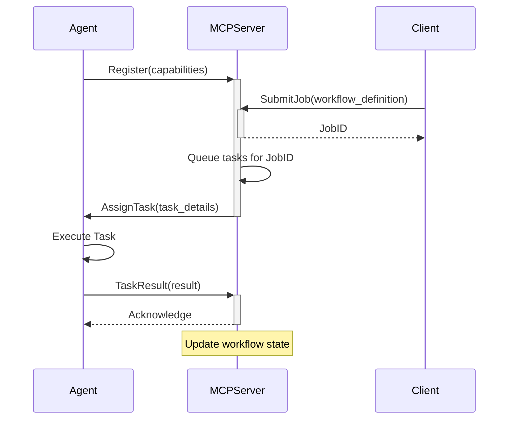

# MCP Servers for Agentic Workflows

[](https://opensource.org/licenses/MIT)

## Overview

This repository contains the implementation of the Master Control Program (MCP) servers. These servers form the backbone of our agentic workflow, providing a robust platform for agents to connect, receive tasks, and execute them within a distributed system.

The primary goal of the MCP is to orchestrate complex workflows by delegating tasks to a fleet of specialized agents. It handles task queuing, agent registration, and state management, ensuring that our automated processes run smoothly and efficiently.

## Features

*   **Agent Registration:** Allows agents to dynamically register themselves with the MCP and declare their capabilities.
*   **Task Distribution:** Manages and distributes tasks to available and capable agents.

## Example Workflows

The MCP is designed to orchestrate a wide variety of agent-based workflows. Here are some of the initial capabilities we are building:

*   **Telegram Notifications Agent:** An agent capable of sending and receiving messages through the Telegram Bot API. This allows workflows to notify users of important events or receive commands from a chat interface.
    *   *Use case:* A CI/CD pipeline workflow could trigger this agent to send a notification to a developer channel when a build is complete or has failed.

*   **Code Style Automation Agent:** An agent that uses `pycodestyle` to analyze Python code, identify style violations, and automatically apply the suggested fixes.
    *   *Use case:* As part of a pre-commit workflow, this agent could be tasked with automatically cleaning up a developer's code before it is submitted for review, ensuring consistent code style across the project.

## Architecture

The system is composed of two main components: the **MCP Server** and **Agents**.

1.  **MCP Server:** The central authority that manages the entire workflow. It exposes an API for agents to connect to and for clients to submit tasks.
2.  **Agents:** Independent processes that connect to the MCP server. Each agent is designed to perform specific tasks (e.g., data processing, API interaction, file manipulation).

The typical workflow is as follows:
1.  Agents start up and register with the MCP server, advertising their capabilities.
2.  A client (or another system) submits a job or workflow to the MCP server.
3.  The MCP server breaks down the job into individual tasks and adds them to a queue.
4.  The MCP server assigns tasks from the queue to idle agents with the required capabilities.
5.  The agent executes the task and reports the result back to the MCP server.
6.  The MCP server tracks the progress of the workflow and moves on to the next steps until the entire job is complete.



## Getting Started

Follow these instructions to get the MCP server up and running on your local machine for development and testing purposes.

### Prerequisites

*   [Language + Version, e.g., Python 3.11+](https://www.python.org/)
*   [Package Manager, e.g., pip, poetry]
*   [Other dependencies, e.g., Docker, Redis]

### Installation

1.  **Clone the repository:**
    ```sh
    git clone https://github.com/[your-org]/[your-repository-name].git
    cd [your-repository-name]
    ```

2.  **Install dependencies:**
    *(Choose the one that applies)*

    Using `pip`:
    ```sh
    pip install -r requirements.txt
    ```

    Using `poetry`:
    ```sh
    poetry install
    ```

### Configuration

The server can be configured via environment variables or a `.env` file. Copy the example configuration file:

```sh
cp .env.example .env
```

Now, edit the `.env` file to match your environment. Key variables include:

*   `MCP_HOST`: The host address for the server to bind to (e.g., `0.0.0.0`).
*   `MCP_PORT`: The port for the server to listen on (e.g., `8000`).
*   `DATABASE_URL`: Connection string for the database.

### Running the Server

To start the MCP server, run the following command:

```sh
python -m mcp.server
```

You should see log output indicating that the server is running and waiting for connections.

## Usage

Agents connect to the MCP server to receive tasks. For details on how to build and run an agent, please see the [agent documentation]([link-to-agent-documentation]).

To submit a new job to the MCP server, you can use the provided client or make an HTTP request.

**Example using `curl`:**

```sh
curl -X POST http://localhost:8000/v1/jobs \
-H "Content-Type: application/json" \
-d '{
      "workflow": "process-data-workflow",
      "payload": { "source_file": "/path/to/data.csv" }
    }'
```

## Contributing

Contributions are welcome! Please feel free to submit a pull request.

## License

This project is licensed under the MIT License - see the LICENSE file for details.
